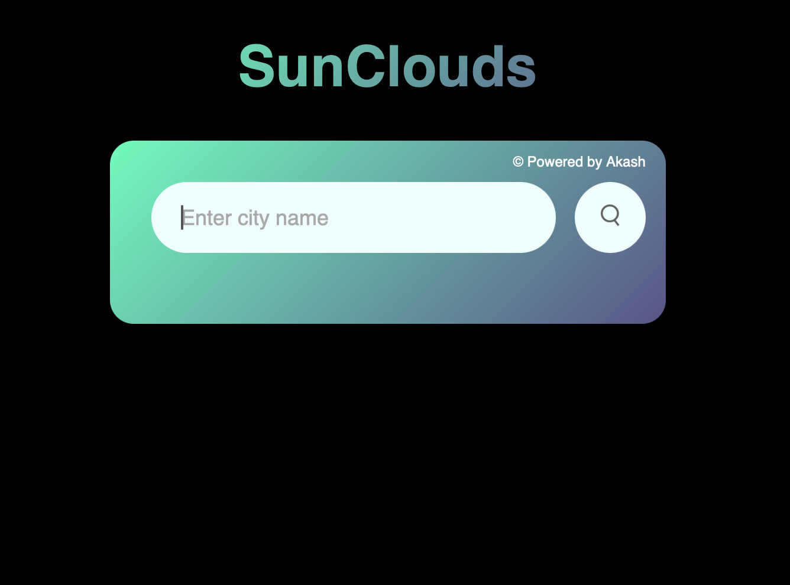

# Weather Website 🌤️

A simple and responsive weather web application that allows users to check the current weather conditions of any city in the world. It fetches live data using a weather API and displays temperature, humidity, wind speed, and weather conditions in a clean UI.

## 🚀 Features
- 🌍 Search weather by city name
- ⏳ Real-time weather updates
- 📊 Displays temperature, humidity, wind speed, and conditions
- 📱 Responsive design for mobile and desktop
- 🎨 Simple and clean UI

## 🛠️ Tech Stack
- **HTML5**
- **CSS3**
- **JavaScript (Vanilla JS)**
- **OpenWeatherMap API**

## 📂 Folder Structure
```
Weather-Website/
│
├── index.html        # Main HTML file
├── style.css         # Styling for the app
├── script.js         # Main JavaScript logic
├── assets/           # Store icons/images/screenshots
│   ├── screenshot1.png
│   └── screenshot2.jpeg
└── README.md         # Project documentation
```

## ⚙️ How It Works
1. **User Input** – The user enters the name of a city into the search box.
2. **API Call** – The app sends a request to the OpenWeatherMap API with the city name and your API key.
3. **Data Processing** – The API returns current weather data (temperature, humidity, wind speed, conditions).
4. **Display** – JavaScript dynamically updates the page with the fetched data.
5. **Error Handling** – If the city name is invalid or there’s an API error, an error message is shown.

## 📷 Screenshots

**Home Screen**


**Weather Data Example**


## 📦 Installation & Usage

1. **Clone this repository**
   ```bash
   git clone https://github.com/akash-collab/Weather-Website.git
   ```

2. **Navigate to project folder**
   ```bash
   cd Weather-Website
   ```

3. **Open `index.html` in your browser**  
   Or use a live server extension in VS Code.

4. **API Key Setup**
   - Sign up at [OpenWeatherMap](https://openweathermap.org/) (or your chosen API provider)
   - Get your API key
   - Add it to the JavaScript file where the API call is made.

## 📌 Tags
`weather` `javascript` `html` `css` `api` `openweathermap` `frontend` `vanillajs`

## 🤝 Contributing
Pull requests are welcome. For major changes, please open an issue first to discuss what you would like to change.

## 📜 License
This project is licensed under the MIT License.
